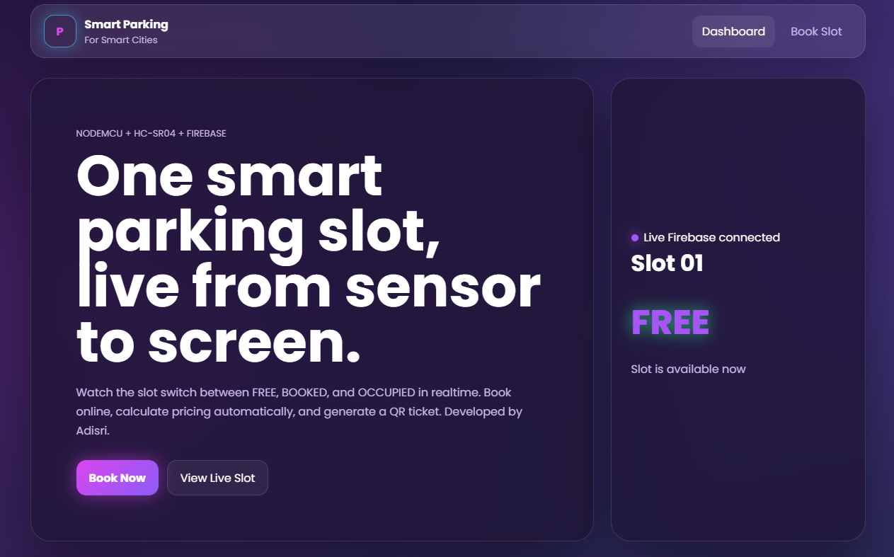
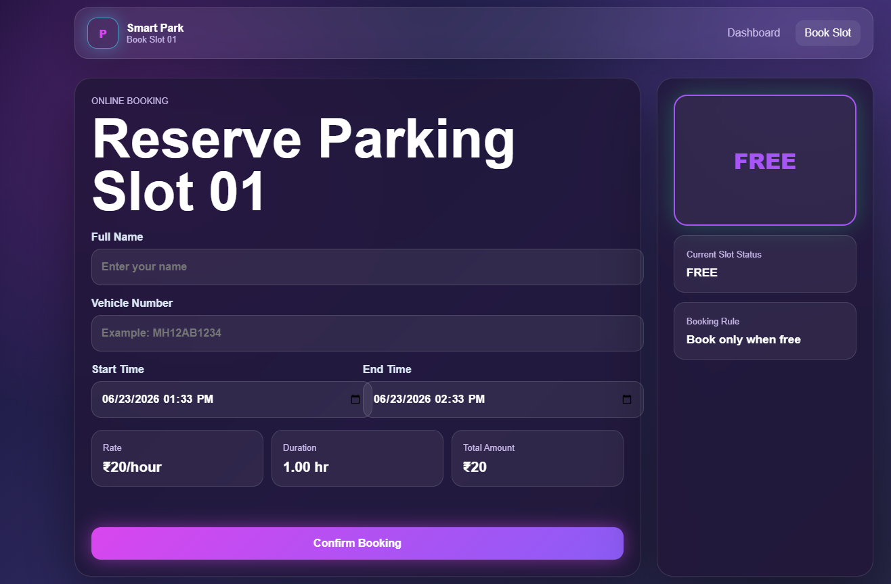
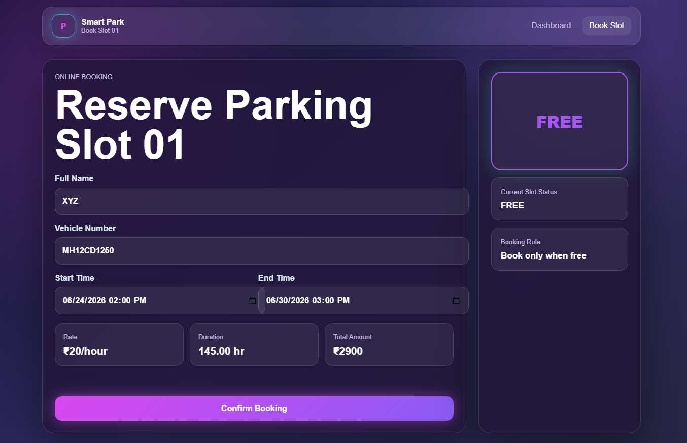
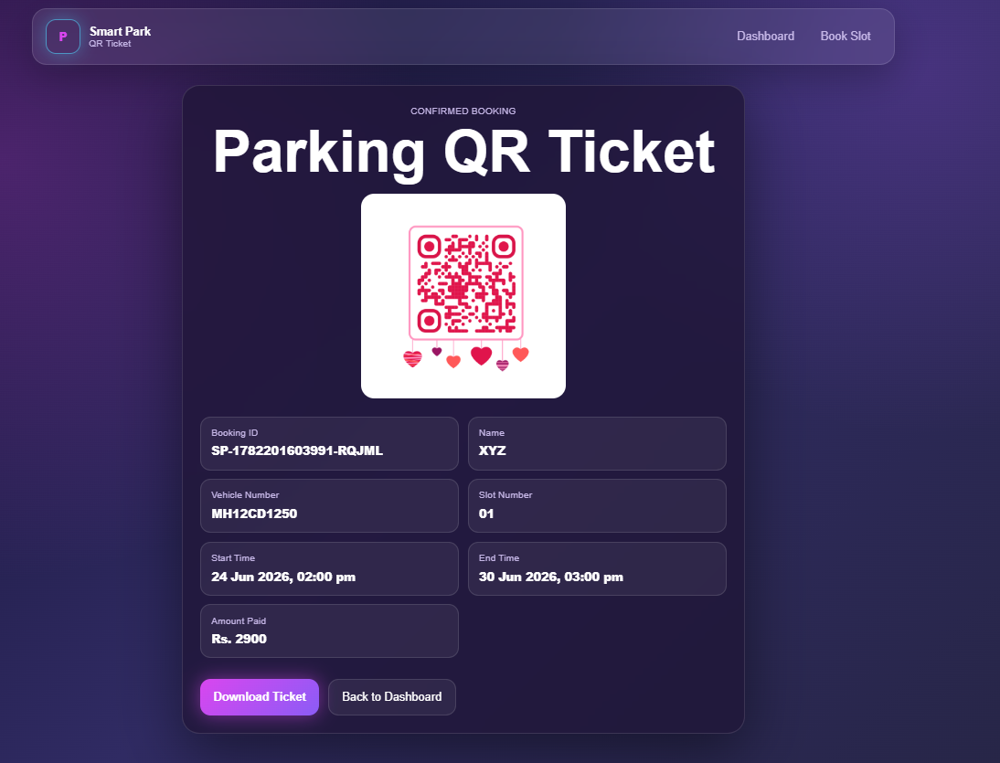

# Smart Parking System for Smart Cities

## Project Overview

Smart Parking System for Smart Cities is an IoT-based parking management solution designed to improve urban mobility by providing real-time parking slot availability, vehicle booking, parking status monitoring, and QR-based parking tickets.

The system enables users to view parking availability, reserve parking slots, receive digital parking tickets, and monitor parking status through an interactive web dashboard. It helps reduce traffic congestion, saves drivers' time, and improves parking space utilization in urban areas.

---

## Problem Statement

Finding parking spaces in crowded urban areas is time-consuming and contributes significantly to traffic congestion. Drivers often spend considerable time searching for available parking slots, which leads to increased fuel consumption and environmental pollution.

This project addresses the issue by providing a smart parking solution that allows users to monitor parking slot availability in real time and reserve parking spaces efficiently.

---

## Objectives

* Monitor parking slot availability.
* Display real-time parking status.
* Enable online parking slot booking.
* Generate QR-based parking tickets.
* Provide vehicle entry and exit monitoring.
* Improve parking management efficiency.
* Reduce traffic congestion.
* Enhance smart city infrastructure.

---

## Features

* Real-time parking slot monitoring
* Parking slot booking system
* QR code ticket generation
* Vehicle information management
* Parking fee calculation
* Entry and exit gate status monitoring
* Vehicle count monitoring
* Firebase Realtime Database integration
* Responsive dashboard interface
* Modern Glassmorphism UI Design
* Mobile-Friendly Interface
* Real-Time Status Indicators

---

## Technology Stack

### Frontend

* HTML5
* CSS3
* JavaScript

### Backend & Database

* Firebase Realtime Database

### IoT Components

* NodeMCU ESP8266
* Ultrasonic Sensor (HC-SR04)

---
## System Architecture

* Ultrasonic Sensor detects vehicle presence.
* NodeMCU ESP8266 sends parking data.
* Firebase Realtime Database stores parking status.
* Web Dashboard retrieves real-time data. 
* Users can view available slots.
* Users can reserve parking slots.
* QR-based tickets are generated.
* Parking status updates automatically.

## Project Workflow

1. User accesses the dashboard.
2. Available parking slot status is displayed.
3. User books an available parking slot.
4. Booking information is stored in Firebase.
5. QR ticket is generated.
6. Parking status updates in real time.
7. Vehicle entry and exit information is monitored.
8. Parking availability is updated automatically.
---

## System Modules

### Parking Dashboard

Displays parking slot availability, occupancy status, and real-time updates.

### Booking Module

Allows users to reserve parking slots.

### Ticket Generation Module

Generates QR-based parking tickets.

### Monitoring Module

Tracks parking status and vehicle information.

---

## Screenshots

### Dashboard

### Booking Page

### Booking Form

### QR Ticket

## Future Enhancements

* Multiple parking slot management
* Automatic vehicle detection
* License plate recognition
* Mobile application integration
* Payment gateway integration

---

## Author

Maaj Alam Bairagdar
Bachelor of Computer Science Engineering
D. Y. Patil Agriculture and Technical University

